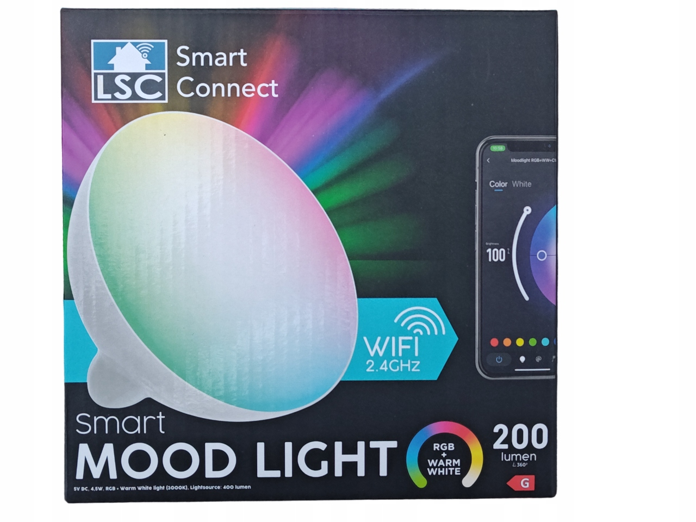
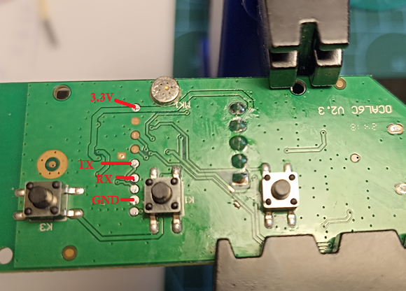

# LSC Moodlight

ESPHome firmware for LSC Smart Mood Light (*3204432*) — RGBW lamp from Action.

Enables local control of the lamp, disconnecting it from Tuya cloud.

## Features

- **4 light effects**: Rainbow, Police, Fireplace, Sound Reactive
- **Music responsiveness** via built-in microphone
- **3 physical buttons**: Effect cycling, Sound Reactive toggle, power switch
- **Home Assistant integration** via API

## Pinout

